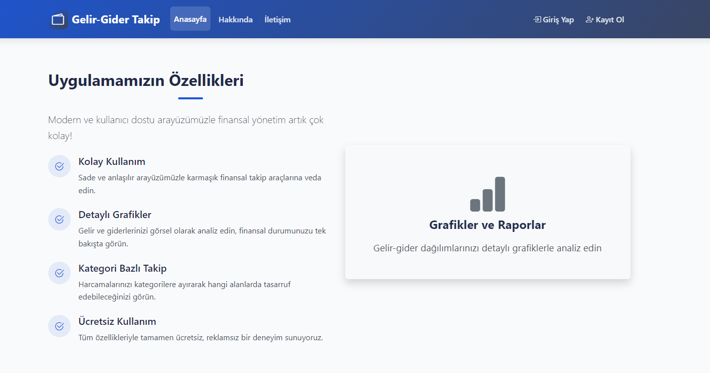
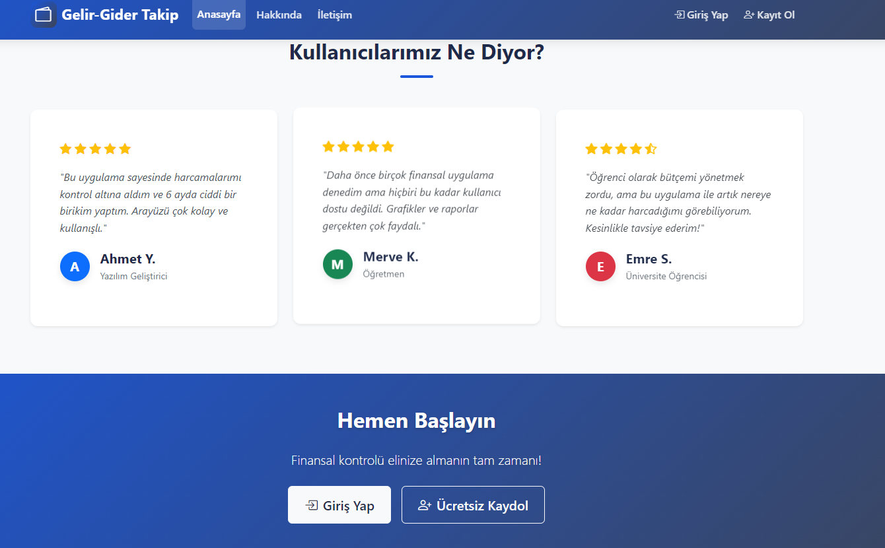
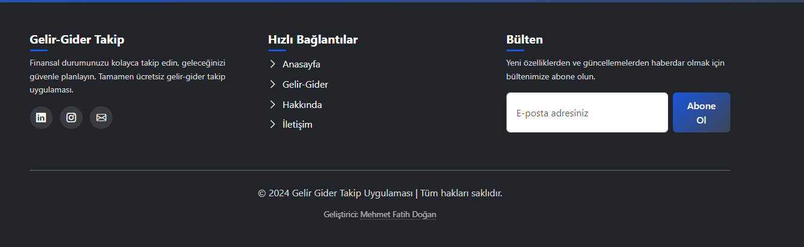
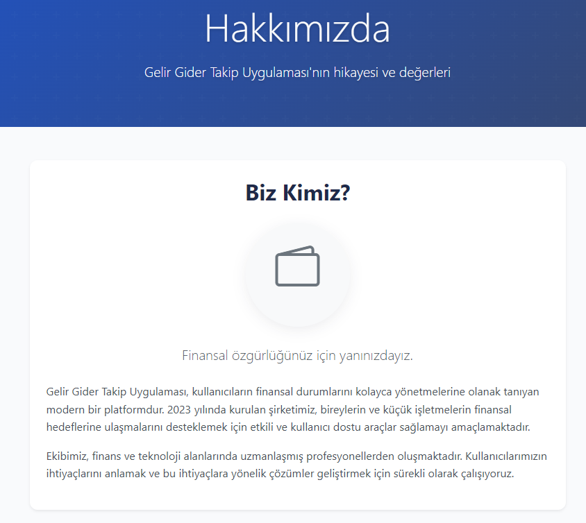
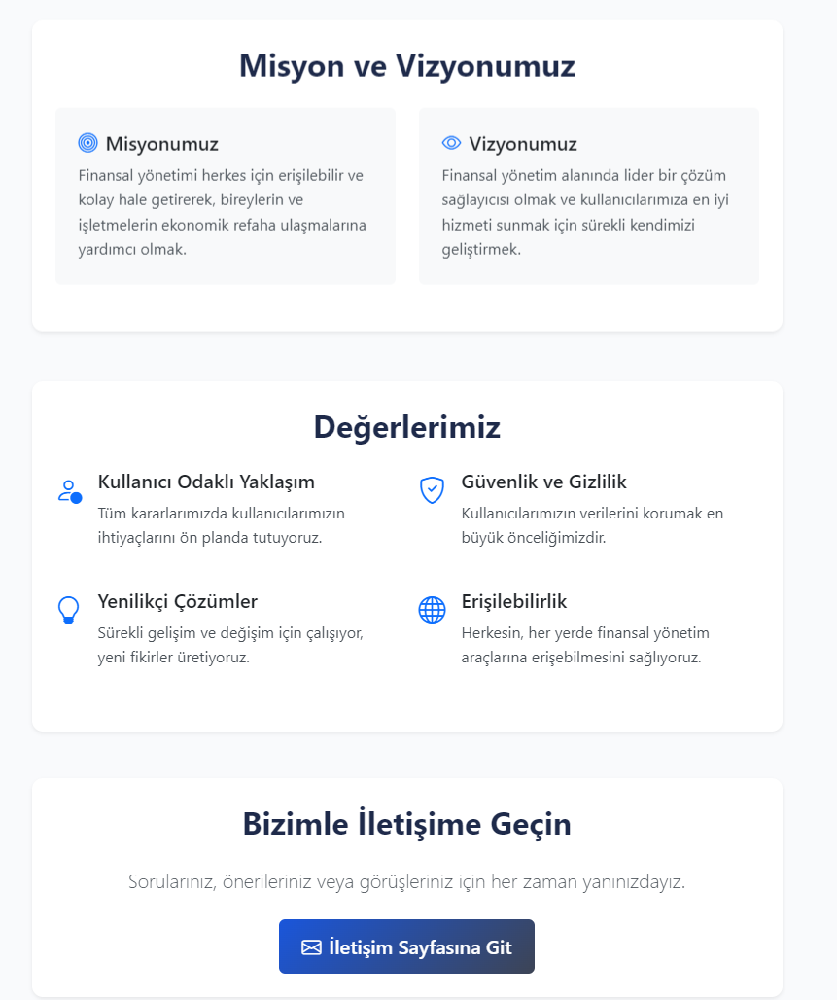
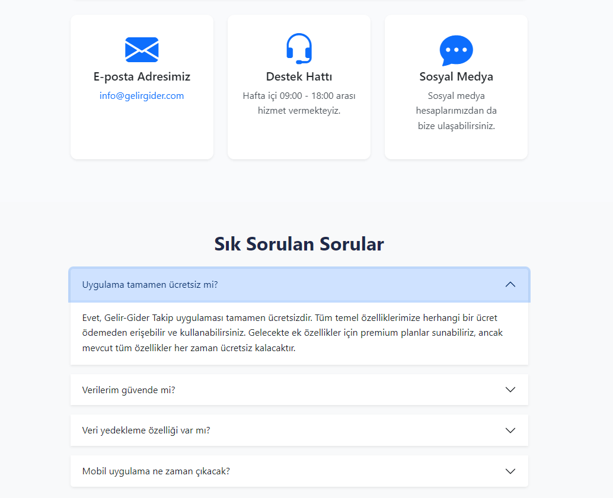
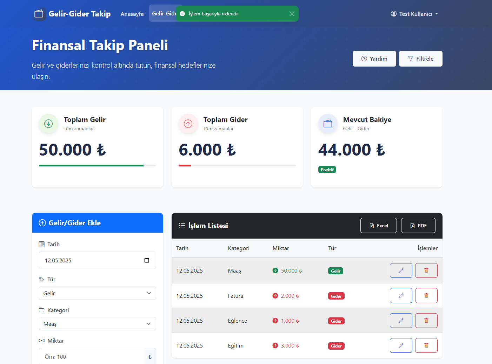
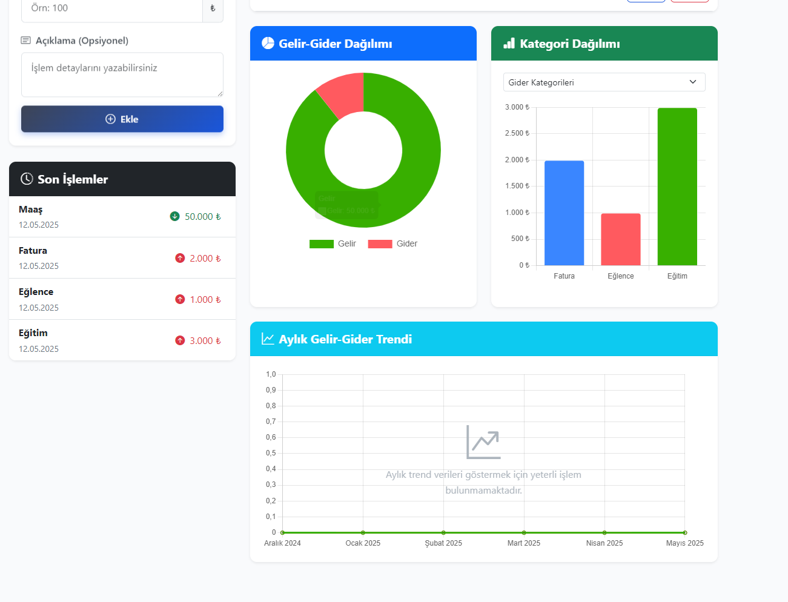

# Gelir Gider Takip Uygulaması

Kişisel finansal yönetim için tasarlanmış kullanıcı dostu bir gelir-gider takip uygulaması. Bu uygulama sayesinde gelir ve giderlerinizi kolayca takip edebilir, kategorilere ayırabilir ve harcama alışkanlıklarınızı analiz edebilirsiniz.

## Özellikler

- **Kullanıcı Yönetimi**: Kayıt olma, giriş yapma ve çıkış yapma
- **Gelir/Gider Takibi**: Gelir ve gider ekleme, düzenleme ve silme işlemleri
- **Kategorilere Ayırma**: Gıda, fatura, ulaşım, eğlence, maaş vb. kategorilerde işlemler
- **Grafiksel Raporlama**: Aylık gelir-gider trendleri, kategori dağılımı ve gelir-gider dengesi
- **Filtreleme**: Tarih, kategori ve tutar aralığına göre filtreleme
- **Veri Dışa Aktarma**: İşlemleri Excel ve PDF formatında dışa aktarma (simülasyon)
- **Profil Yönetimi**: Kullanıcı bilgilerini güncelleme ve şifre değiştirme

## Ekran Görüntüleri


























## Teknolojiler

- **Frontend**: HTML5, CSS3, JavaScript (ES6)
- **Framework**: Bootstrap 5
- **Grafik Kütüphanesi**: Chart.js
- **Veri Saklama**: LocalStorage (tarayıcı tabanlı)
- **Responsive Tasarım**: Tüm cihaz boyutlarında uyumlu

## Kurulum

1. Projeyi bilgisayarınıza klonlayın:
   ```bash
   git clone https://github.com/kullanici/gelir-gider-takip.git
   ```

2. Proje dizinine gidin:
   ```bash
   cd gelir-gider-takip
   ```

3. `index.html` dosyasını tarayıcınızda açın

## Kullanım

1. Uygulamayı açtıktan sonra "Ücretsiz Başlayın" butonuna tıklayarak kayıt olun
2. Test hesabı ile giriş yapmak için:
   - Kullanıcı adı: `test`
   - Şifre: `123456`
3. Gelir veya gider eklemek için "Gelir-Gider" sayfasına gidin
4. İşlemlerinizi kategorilere ayırarak ekleyin
5. Grafikler sekmesinden finansal durumunuzu analiz edin

## Katkıda Bulunma

1. Forklayın (`https://github.com/kullanici/gelir-gider-takip/fork`)
2. Yeni bir özellik dalı oluşturun (`git checkout -b feature/YeniOzellik`)
3. Değişikliklerinizi commit edin (`git commit -am 'Yeni özellik eklendi'`)
4. Dalınızı push edin (`git push origin feature/YeniOzellik`)
5. Yeni bir Pull Request oluşturun

## Lisans

Bu proje MIT Lisansı ile lisanslanmıştır. Daha fazla bilgi için [LICENSE](LICENSE) dosyasına bakın.

## İletişim

Proje ile ilgili sorularınız için [issues](https://github.com/kullanici/gelir-gider-takip/issues) kısmını kullanabilirsiniz.
